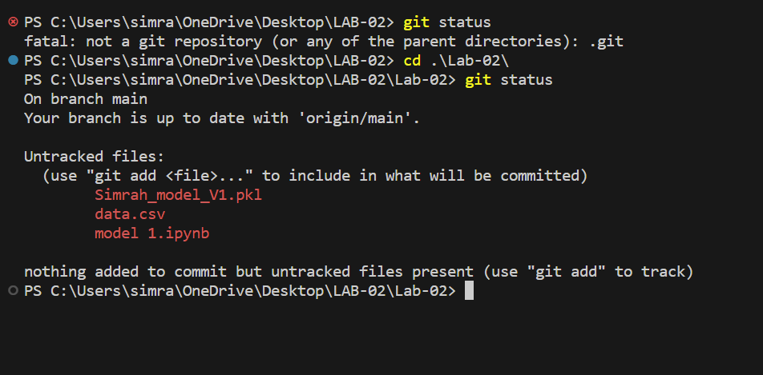
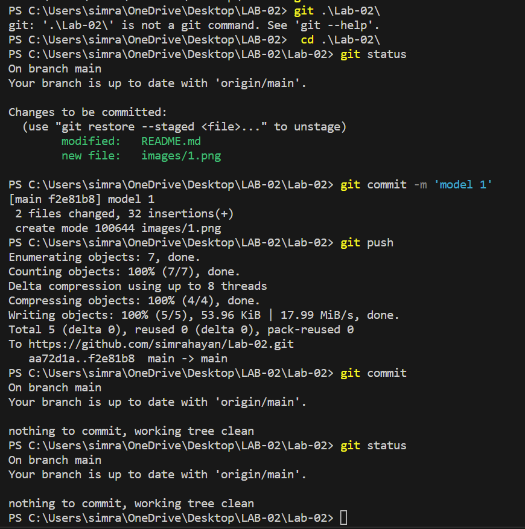

# Lab-02 AML
# Breast Cancer Prediction using Machine Learning

## Introduction
Breast cancer is a critical health issue affecting millions of women worldwide. Machine learning techniques can be utilized to predict breast cancer and aid in early detection, which is crucial for successful treatment. In this document, we will explore a machine learning approach to predict breast cancer.

## Dataset
For this project, we will use the Breast Cancer Wisconsin (Diagnostic) dataset, available from the UCI Machine Learning Repository. The dataset contains features computed from digitized images of fine needle aspirates (FNA) of breast mass. It includes various attributes such as radius, texture, smoothness, compactness, concavity, and more. The target variable indicates whether the tumor is malignant (M) or benign (B).

## Data Preprocessing
Before applying machine learning algorithms, we need to preprocess the data. This involves steps such as handling missing values, scaling the features, and splitting the dataset into training and testing sets.

## Feature Selection
To improve the prediction performance and reduce dimensionality, we can employ feature selection techniques. This helps to identify the most informative features that contribute significantly to the prediction.

## Model Selection and Training
We can experiment with various machine learning algorithms such as logistic regression, support vector machines (SVM), random forests, or neural networks. By training the selected model on the preprocessed dataset, we can build a predictive model for breast cancer.

## Model Evaluation
Once the model is trained, we need to evaluate its performance using appropriate evaluation metrics such as accuracy, precision, recall, and F1-score. We can also employ techniques like cross-validation to obtain more reliable performance estimates.

## Conclusion
Breast cancer prediction using machine learning offers a promising approach for early detection and improved patient outcomes. By leveraging the power of ML algorithms, we can assist medical professionals in making accurate predictions, aiding in diagnosis and treatment decisions.

STEPS-

